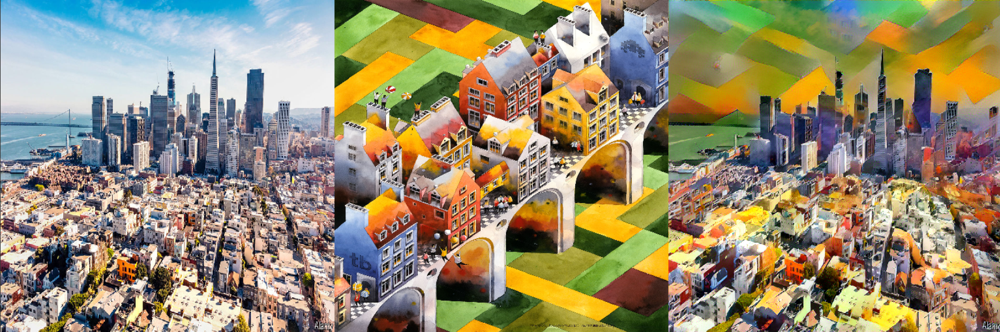

# CODECRAFT_GA_05

# 🎨 Neural Style Transfer using TensorFlow 

> *"Combining the soul of one image with the structure of another — that’s the power of Generative AI."*

## 📌 Internship Task Overview

As part of my **Generative AI Internship at CodeCraft**, I was assigned a core project: **Neural Style Transfer (NST)**. The goal was to build a Python-based system that takes a **content image** (structure) and a **style image** (artistic texture) and blends them into a **stylized image**, using **deep learning** techniques.

This project focuses on applying a pre-trained deep learning model (**VGG19**) to merge two visual inputs and generate artistic outputs through **gradient-based optimization**.

---

## 🖼️ Sample Result

<p align="center">
   
</p>

---

## 🧠 What I Learned

- How **pre-trained convolutional neural networks** (CNNs) extract feature maps.
- How to optimize image pixels using **loss functions** instead of updating model weights.
- Learned concepts like:
  - **Content loss**, **Style loss**, and **Total variation loss**
  - Using **TensorFlow GradientTape**
  - Real-time image generation using **interactive sliders** in Colab.
- Best practices for **Colab deployment**, image preprocessing, and result visualization.

---

## ⚙️ Setup Instructions

1. **Clone the repository**
   ```bash
   git clone https://github.com/your-username/neural-style-transfer.git
   cd neural-style-transfer
Install Dependencies

pip install -q tensorflow matplotlib


🧰 Tools & Technologies Used
🧠 TensorFlow – For neural network processing and optimization

🎨 VGG19 – Pre-trained model for feature extraction

📊 Matplotlib – Image display and plotting

📎 IPyWidgets – For slider interaction in Colab

🔍 Google Colab – Fast prototyping environment

💾 Pillow (PIL) – Image processing

🧑‍💻 Core Code Explanation
Here's a simplified version of the main logic:


# Load the content and style image
content_image = load_img("content.jpg")
style_image = load_img("style.jpg")

# Preprocess and extract features
model = VGG19(include_top=False, weights='imagenet')
outputs = model([content_image, style_image])

# Define loss functions
content_loss = MSE(content_features, generated_features)
style_loss = GramMatrixLoss(style_features, generated_features)

# Minimize total loss
optimizer = tf.optimizers.Adam(learning_rate=5.0)
train_step = optimizer.minimize(total_loss, var_list=[generated_image])
✅ Full code is available in the notebook with comments and visualization at each stage.

🛠️ How I Solved the Problems
✅ Fixed upload errors by reordering cells for extractor and file handling.

✅ Solved structure mismatch warnings in TensorFlow by standardizing shapes.

✅ Fixed runtime freeze by reducing iterations and switching to CPU optimization-friendly format.

✅ Used tight layout and axis hiding for clean visual output.

✅ Added files.download() to download generated image after result.

📥 Output Features
Upload content and style images interactively

See all three images (content, style, and result) side-by-side

Adjustable iterations (50–500 range) using slider

One-click download button for stylized output

🌟 Future Improvements
Integrate GAN-based transfer models (like Fast Style Transfer).

Add batch processing for generating multiple results.

Improve quality with adaptive learning rate scheduling.

✨ Final Thoughts
This project was more than just coding – it was an artistic exploration powered by deep learning. I now understand how AI can create expressive visual experiences.

Big thanks to CodeCraft for the incredible opportunity to explore Generative AI in a hands-on way.
Author - Aniket Singh

🤝 Connect with Me
📧 aniket@example.com
🔗 LinkedIn
🧠 Portfolio


